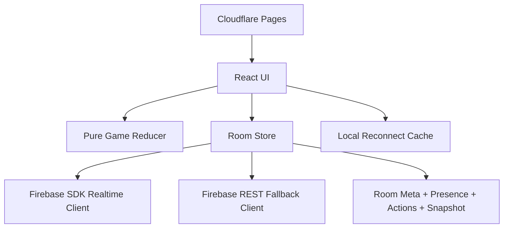

# OFC-GPT

Production-ready multiplayer Open Face Chinese Poker built with React, TypeScript, Firebase Realtime Database, and Cloudflare Pages.

[Live Demo](https://ofc-gpt.pages.dev)

[](https://www.typescriptlang.org/)
[](https://react.dev/)
[](https://vite.dev/)
[](https://firebase.google.com/docs/database)
[](https://pages.cloudflare.com/)

## Why This Project
I built this project to demonstrate full-stack product engineering in a real-time environment:
- Designing deterministic game logic that remains consistent across clients.
- Building resilient multiplayer sync with reconnect handling and fallback paths.
- Shipping a polished UX and deploying to production infrastructure.

This repo is intentionally designed to showcase engineering judgment, not just feature implementation.

## Portfolio Highlights
### Realtime Multiplayer Reliability
- Event-sourced action log with session/version controls (`gameId` + `actionsVersion`).
- Realtime-first Firebase subscriptions with automatic polling fallback.
- Outbound action queue + retry behavior to survive transient failures.
- Presence model using heartbeats and peer acknowledgements for connection status.

### Reconnect and Data Consistency
- Local cache for fast recovery (`localStorage`) with safe session validation.
- Delta replay of missing actions on top of cached state.
- Regressive snapshot protection to avoid stale state overwrites.
- Hydration strategy that resolves out-of-order action delivery safely.

### Deterministic Game Engine
- Pure reducer-based state transitions.
- Strongly typed action/state model in TypeScript.
- Enforced turn order, phase boundaries, line limits, and round completion rules.
- Commit/reveal primitives included for provable shuffle flows.

### Production Delivery
- Frontend deployed to Cloudflare Pages.
- Automated test suite covering engine, sync, cache, and realtime behavior.

## Architecture (High-Level)


## Tech Stack
- Frontend: React 18, TypeScript, Vite
- Realtime/Data: Firebase Realtime Database
- Infra: Cloudflare Pages
- Testing: Vitest
- Linting: ESLint

## Skills Demonstrated
- Realtime systems design
- State machine and reducer architecture
- Idempotency and distributed consistency strategies
- Fault-tolerant reconnect workflows
- Type-safe API and domain modeling
- Production deployment and operational tooling

## Codebase Tour
```text
src/
  engine/   # scoring, validation, hand eval, dealing
  state/    # game state types and pure reducer
  sync/     # Firebase clients, room store, hydration, local cache
  ui/       # App, lobby, game table, UX utilities
  crypto/   # commit/reveal + deterministic RNG helpers
  utils/    # transport usage instrumentation
tests/
  *.test.ts(x)
```

## Local Setup
### Prerequisites
- Node.js `>=20`
- npm `>=10`

### Install and Run
```bash
npm install
npm run dev
```

### Build and Test
```bash
npm run build
npm test
```

## Environment Variables
```bash
VITE_FIREBASE_API_KEY=...
VITE_FIREBASE_AUTH_DOMAIN=...
VITE_FIREBASE_DATABASE_URL=https://<project-id>-default-rtdb.firebaseio.com
VITE_FIREBASE_PROJECT_ID=...
VITE_FIREBASE_APP_ID=...
```

Optional:
```bash
VITE_TRANSPORT_LOGGING=true
```

## Deployment
### Cloudflare Pages (frontend)
```bash
npm run build
npx wrangler pages deploy dist --project-name ofc-gpt --branch main
```

## Notes
- Room entries are TTL-based and cleaned up automatically.
- Firebase SDK realtime subscriptions are preferred; REST polling is used as fallback.
- Commit/reveal crypto utilities are implemented and available; current UI defaults to simplified non-crypto bootstrap in `src/ui/App.tsx`.
